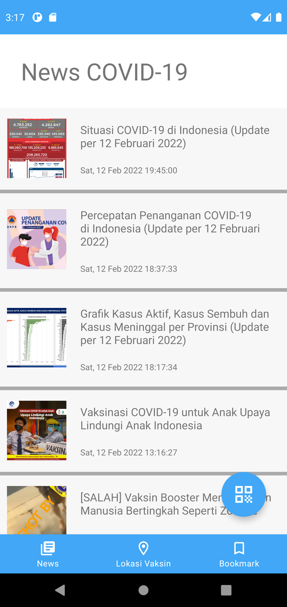
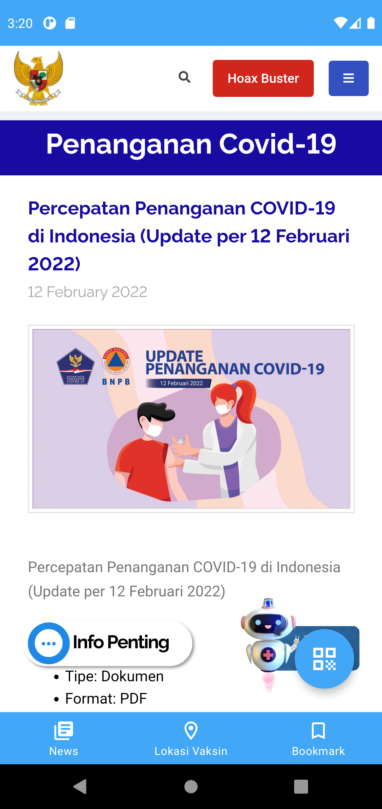
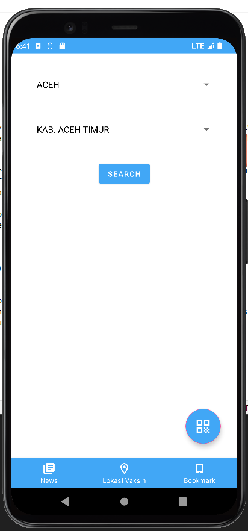
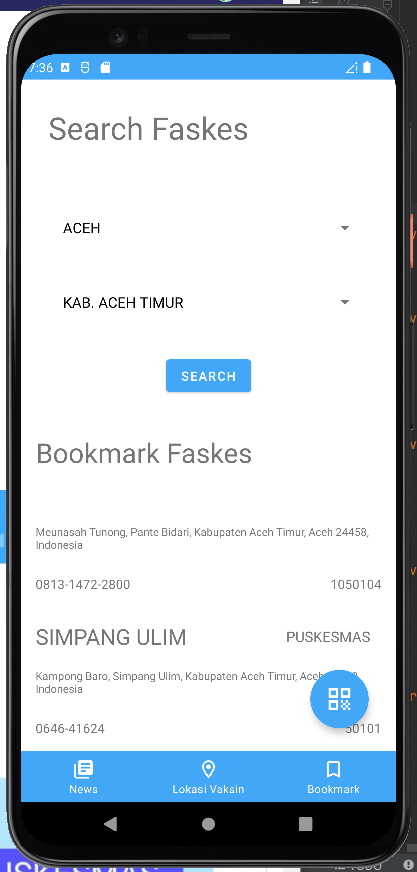
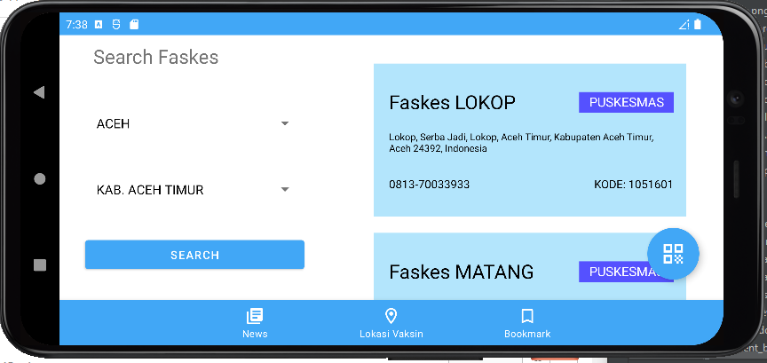
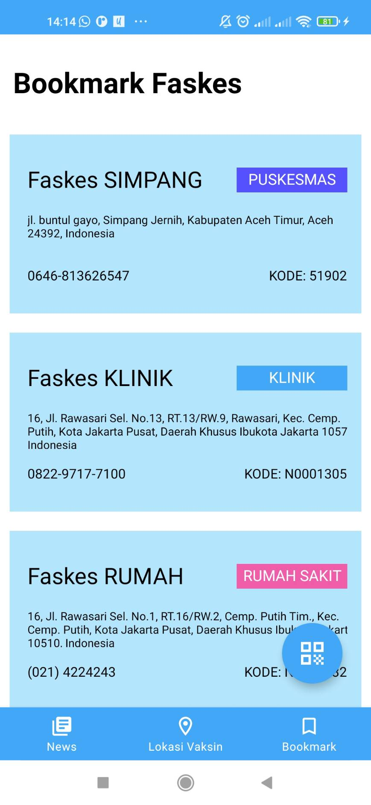
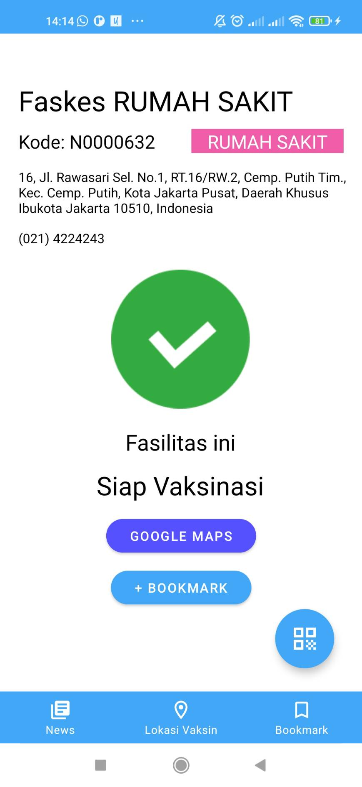
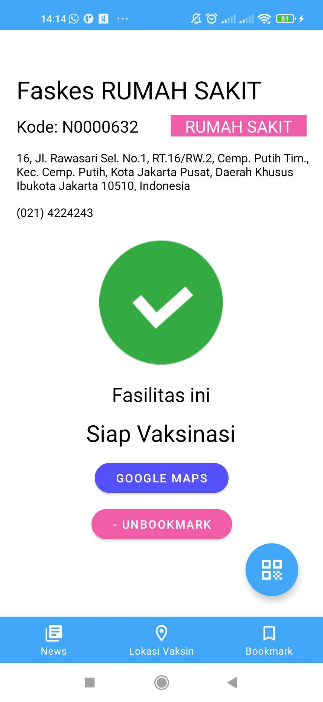

# IF3210-2022-Android-14

## Table of contents
* [General info](#general-info)
* [Screenshots](#screenshots)
* [Libraries](#libraries)
* [Features](#features)
* [Creators](#creators)

## General info
Pada aplikasi ini, terdapat beberapa layar yang dibuat, diantaranya layar daftar berita COVID-19, detail berita COVID-19, pencarian faskes, daftar faskes untuk vaksinasi, detail faskes, daftar bookmark faskes dan layar check-in

Untuk layar berita COVID-19, menggunakan fragment yang dihost pada activity utama. Kemudian akan menampilkan kumpulan berita yang berisi judul, tanggal publikasi, serta thumbnail dari artikel tersebut. Jika pengguna meng-klik salah satu berita, maka akan diarahkan ke webview yang berisi berita lengkap dari judul yang di klik.

Untuk layar pencarian faskes, menggunakan fragment yang dihost pada activity utama. Jika pengguna melakukan search, akan keluar layar daftar faskes berdasarkan hasil pencarian. Layar pencarian faskes jika diubah orientasinya menjadi landscape akan berada di kiri dan daftar faskes di kanan.

Untuk layar check-in, menggunakan activity berbeda dari activity utama. Pada saat membuka layar akan diminta permission camera dan location, kamera akan otomatis menyala jika sudah diberi permission. Jika QR code terdeteksi akan mengeluarkan status dan alasan.

## Screenshots
### Halaman News

### Halaman News Detail

### Halaman Search

### Halaman Search Results

### Halaman Search Landscape

### Halaman QR

### Halaman QR Temperature

### Halaman Bookmark

### Halaman Detail Faskes

### Halaman Detail Faskes (Bookmarked)

## Libraries
* Budiyev Code Scanner - Library untuk QR Code Scanner
* Google Play Services Location - Library untuk mendapatkan lokasi melalui Google Play Services
* Material - Library untuk component yang sudah disediakan oleh Google
* Room - Library untuk mengakses sqlite room component
* Lifecycle - Library untuk memantau LiveData pada ViewModel
* Couroutine - Library untuk mengelola IO ViewModel secara asinkron

## Features
* Fragment Daftar Faskes 	: 13519053
* Setup + Integrasi Database 	: 13519053
* Detail Faskes 		: 13519053
* Daftar Berita 		: 13519027
* Detail Berita 		: 13519027
* Setup Retrofit		: 13519027
* Bottom Navbar			: 13519027
* Search Faskes			: 13519035
* Check-in			: 13519035
* Splash screen			: 13519035

## Creators
- Haikal Lazuardi Fadil		13519027
- Fakhri Nail Wibowo		13519035
- Alifah Rahmatika Basyasya 	13519053